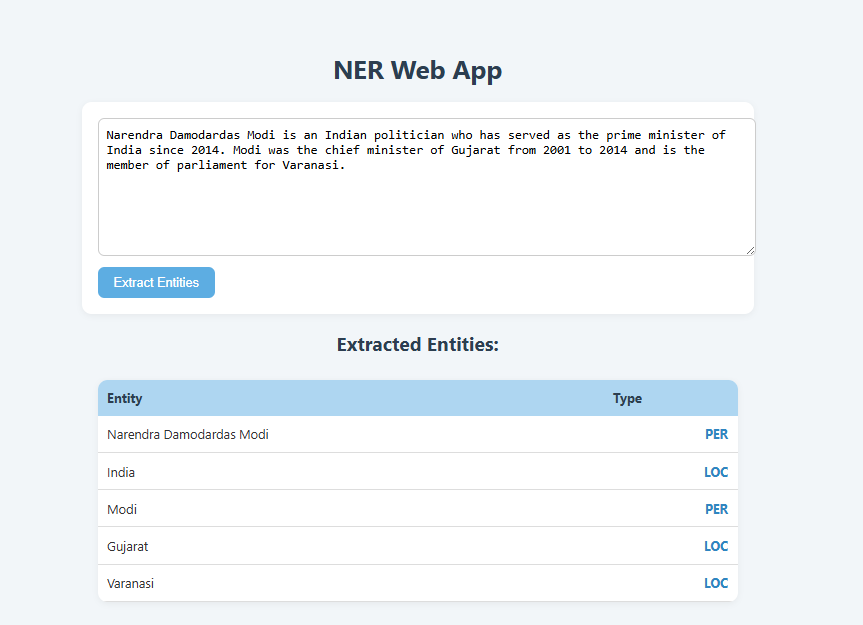

# Named Entity Recognition (Multilingual)
## English

## Hindi

This project implements a Named Entity Recognition (NER) system that identifies and classifies entities like people, locations, and organizations from input text. It supports both English and Hindi using a BiLSTM-based custom model and Hugging Face's multilingual transformer (xlm-roberta-base-ner-hrl). The system is designed for real-time entity extraction via CLI and API, with support for multilingual datasets.
